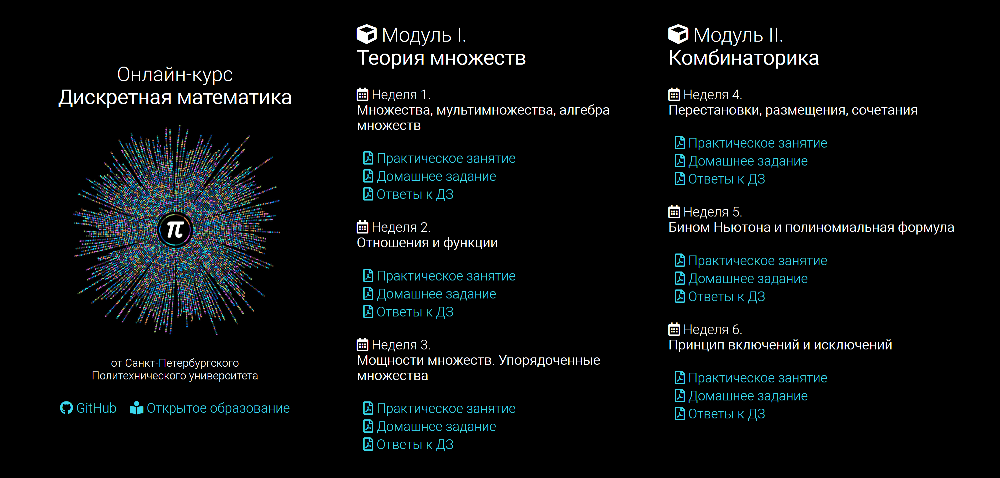

# Онлайн-курс «Дискретная математика»

### О репозитории

Данный репозиторий представляет собой сборник материалов онлайн курса по дискретной математике от Санкт-Петербургского Политехнического университета.

### На данный момент доступны

#### Модуль I. Теория множеств

- **Неделя 1. Множества, мультимножества, алгебра множеств:**
  - :page_facing_up: [практическое занятие](Docs/Practice/1-week/Практика.pdf),
  - :page_facing_up: [домашнее задание](Docs/Homeworks/1-week/ДЗ.pdf),
  - :page_facing_up: [ответы к домашнему заданию](Docs/Homeworks/1-week/answers/Ответы.pdf).
- **Неделя 2. Отношения и функции:**
  - :page_facing_up: [практическое занятие](Docs/Practice/2-week/Практика.pdf),
  - :page_facing_up: [домашнее задание](Docs/Homeworks/2-week/ДЗ.pdf),
  - :page_facing_up: [ответы к домашнему заданию](Docs/Homeworks/2-week/answers/Ответы.pdf).